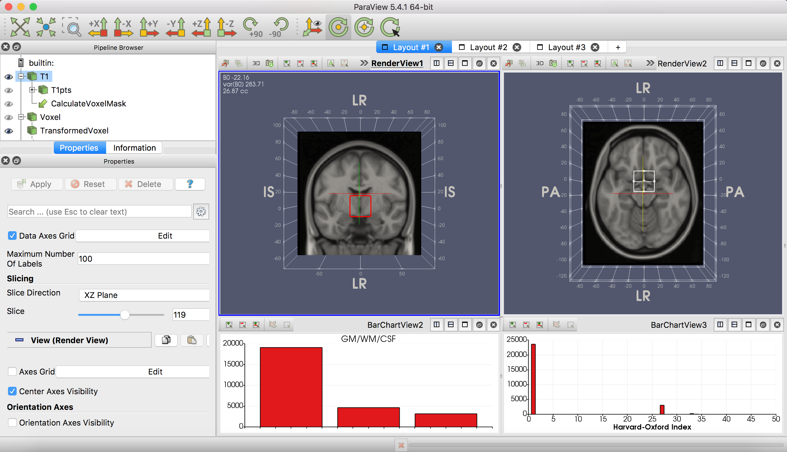
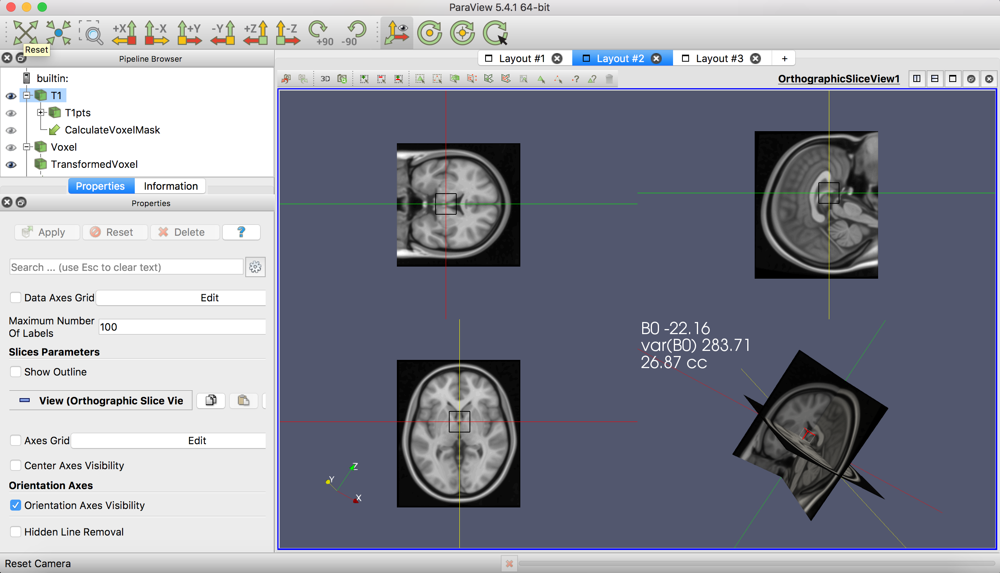
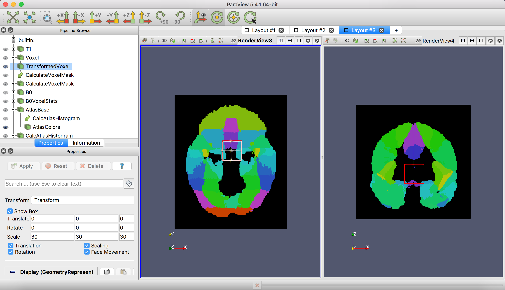
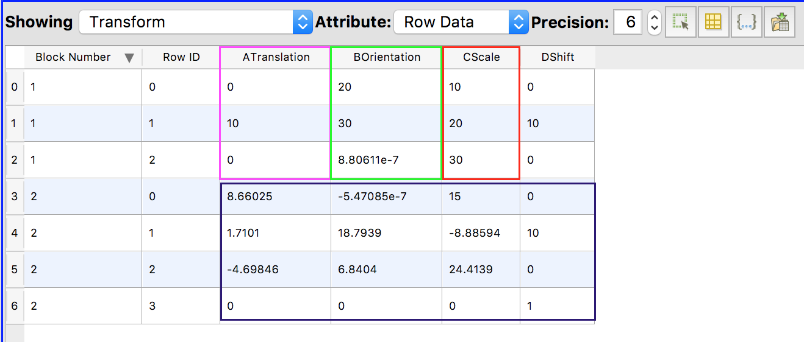
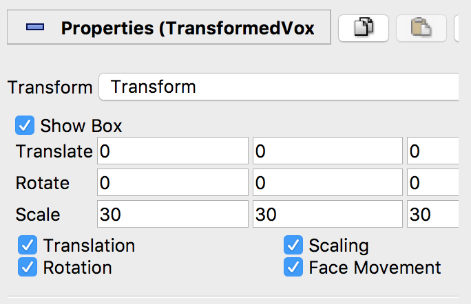
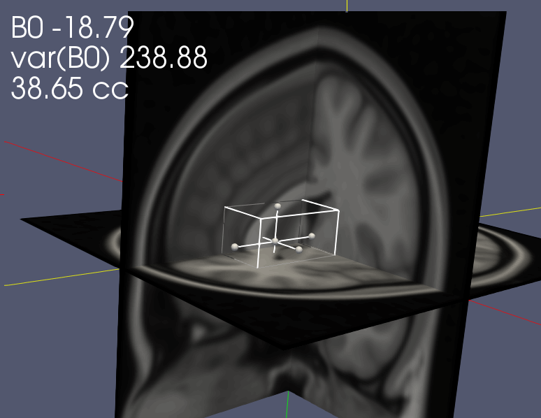

# Voxel Positioning System for Magnetic Resonance Spectroscopy

# Overview

The Voxel Positioning System (VPS) is a tool prototyped as a [ParaView](https://www.paraview.org) pipeline for interactively placing bounding boxes on a 3D volume, intended as an aid for planning single voxel magnetic resonance spectroscopy (MRS) experiments. 

VPS allows you to easily evaluate the feasibility of different voxel geometries based on expected field homogeneity, tissue fractions, and ROI content of a voxel. The desired geometry can then be saved as a transform that can be aligned to individual anatomy and/or entered directly into the scanner console to support systematic voxel placement across participants. Notably, this supports oblique voxel orientations around any axis.

## Features

- Interactive voxel positioning
- Oblique voxels
- Live display of 
	- B0 field inhomogeneity 
	- GM/WM/CSF proportions
	- Atlas-based ROI overlap
- Calculates the linear transform matrix associated with the voxel position

# Setup

1. [Download](https://www.paraview.org/download/) and install ParaView (tested with 5.4.1)
2. Enable the ParaView AnalyzeNIfTIIO plugin (`Tools->Plugin Manager`). Click the expand arrow next to the plugin name and check the `Auto Load` box to automatically load the plugin each time you use ParaView. Click `Load Selected` and close the dialog.
3. In ParaView, go to `File->Load State` and select the `vps.pvsm` file. Click `Ok`
4. In the `Load State Options` dialog, select `Search files under specified directory` and choose the main voxel tool directory. ParaView should find the required files under `data/templates`.

# Usage

## Interface
Four layouts are defined:

### Layout 1: 3D anatomy slice view and voxel composition

By default, slices are shown in neurological (left = left) orientation, but it is possible to reorient the axes. 

#### Tissue composition
The left bar chart is a histogram of the number of points (1mm voxels) within the voxel that are labelled as grey matter, white matter, or CSF. Template labels are maximum probability labels from the MNI152 tissues priors included in FSL. Relying on the template will likely overestimate the typical proportion of GM in your voxel.

#### Atlas labels
The right bar chart is a histogram of the number of points (1mm voxels) within the voxel that are labelled as being part of an atlas-based ROI. 

### Layout 2: Orthographic slice view

Another view for positioning the voxel.

### Layout 3: 3D atlas slice view

Like Layout 1, the voxel is shown as a wireframe over slices of an anatomical volume. The volume in this case is the index atlas image. The template is the [FSL Harvard-Oxford atlas](https://fsl.fmrib.ox.ac.uk/fsl/fslwiki/Atlases).

### Layout 4: Transform

This layout displays the transform parameters. The parameters are confusingly shown in a MultiBlockDataset.

- Block 1 contains the 3x1 column vectors for translation, rotation (in degrees) and scaling parameters.
- Block 2 contains the 4x4 linear transform matrix.

These parameters can be saved to a spreadsheet.

### Annotation
The layouts are annotated with information about the mean and variance of the B0 field shift (in Hz) within the voxel, and the approximate volume of the voxel in cubic centimeters (cc). The annotation updates as you apply transformations to the voxel. The template B0 map is from [POSSUM](https://fsl.fmrib.ox.ac.uk/fsl/fslwiki/POSSUM/UserGuide).

### Pipeline Browser

The `Pipeline Browser` pane on the left allows you to select and manipulate elements in the display. In the default use case with template images, you should only modify the properties of the `T1`, `TransformedVoxel` and `AtlasColors` objects.

#### Change the displayed slice

1. Click on one of the slice views in the layout (the selected view name will be bolded and underlined in a fit of typographical exuberance).
2. Click on the displayed volume (either `T1` or `AtlasColors`) in the Pipeline Browser. 
3. Scroll to the bottom of the `Display` section of the Properties tab to adjust the `Slice Direction` and index of the displayed `Slice`

#### Numerically adjust the voxel position

1. Select `TransformedVoxel` (not `Voxel`!) in the Pipeline Browser
2. Enter the desired translation, rotation and scaling parameters. `Scale` should be the dimensions of the voxel in mm.
3. Click `Apply`

#### Interactively adjust the voxel position

1. Click on one of the slice views in the layout (the selected view name will be bolded and underlined in a fit of typographical exuberance).
2. Adjust the slices and perspective (click and drag in the render window or use the axis toolbar buttons) so that the voxel wireframe is visible.
3. Select `TransformedVoxel` (not `Voxel`!) in the Pipeline Browser
4. Select and drag the small balls on the voxel wireframe to move and resize. The center ball moves, the others resize.
5. Click and drag on a wireframe face to rotate the voxel.
6. Click `Apply` in the `TransformedVoxel` properties page to update the transform. Click `Reset` to discard changes. 

# FAQ

### Why is the volume of the voxel shown in the annotation smaller than the volume of `Transformed Voxel`?

The volume in the annotation is calculated (in `B0VoxelStats->Stats->AnnotVoxelSize`) as (number of grid points within the voxel geometry)/1000. The number of grid points within the bounding box (which is not defined on a grid) depends somewhat on the orientation of the box with respect to the grid and will often be slightly less than the expected volume. From an acquisition perspective, your voxel geometry will be approximately the geometry of the bounding box, subject to the effectiveness of OVS and other scan parameters.

### Can I use this with other MRI volumes?
Yes. The NIfTI files used for the B0 map (`B0`), atlas (`AtlasBase`) and anatomical volume (`T1`) can be changed (e.g. to subject-specific data) by editing the `File Name ` field in the respective `Properties` pages or changing the file selection when loading the state. The three volumes must all be in alignment and have the same grid size. A 1mm isotropic grid is assumed. Note that color scaling, the atlas histogram display and possibly other elements ofthe state may need to modified as well.

